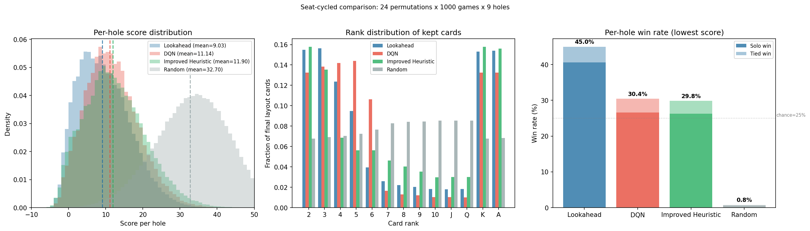
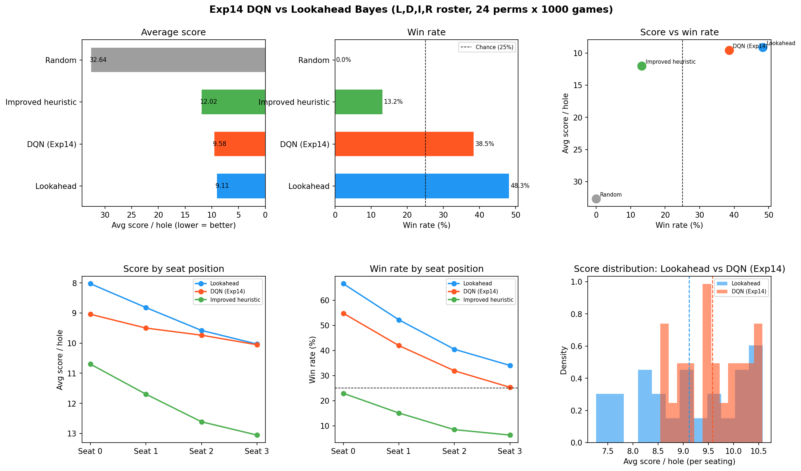

# Golf

A simulator for the card game [Golf](https://en.wikipedia.org/wiki/Golf_(card_game)) and a testing platform for game-playing agents. Includes a vectorized engine, population-based DQN training, a belief-tracking Bayes lookahead player, hand-coded heuristics, and an LLM player harness, all evaluated against each other through a shared seat-cycling harness.

This README documents the components and how to use them.

## Game rules

Four players. Each player has 6 cards in a 2×3 grid, all face-down except two flipped at deal. On your turn:

1. **Draw:** take the top card from the discard pile, *or* draw blind from the deck.
2. **Place or flip:** put the held card at any grid position (the replaced card goes to discard, face-up), *or* discard the held card and flip one of your face-down cards.

The hole ends when any player has all 6 cards revealed; everyone else gets one final turn. After 9 holes, lowest cumulative score wins.

**Scoring:** 2 = -2, 3-9 = face value, 10/J/Q = 10, K = 0, A = 1. Matching ranks in the same column zero each other out.

## Install

```bash
git clone https://github.com/vgainullin/golf.git
cd golf
uv sync
uv run python -m pytest tests/
```

---

## Components

### Vectorized game simulator — `src/vectorized_golf.py`

Fast batched Golf engine. Runs thousands of games in parallel on CPU or GPU via PyTorch tensors. The state is a single `VectorizedGolfState` dataclass containing the deck, discard pile, all four players' cards, and a `revealed` mask.

```python
import torch
from src.vectorized_golf import (
    reset_games, get_observation_v2,
    step_stage0, step_stage1,
    heuristic_stage0, heuristic_stage1,
    compute_final_score,
)

device = torch.device("cpu")
state = reset_games(N=1024, device=device)  # 1024 games in parallel

for hole in range(9):
    while not state.done.all():
        for pid in range(4):
            obs = get_observation_v2(state, pid)              # (N, ...) tensor
            actions = heuristic_stage0(state, pid)            # or your policy
            step_stage0(state, actions, pid)
            actions = heuristic_stage1(state, pid)
            step_stage1(state, actions, pid)

scores = compute_final_score(state.player_cards, device)      # (N, 4) tensor
```

Built-in policies: `random_stage{0,1}`, `simple_stage{0,1}` (greedy low cards), `heuristic_stage{0,1}` (column-aware), `improved_stage1` (also replaces revealed cards), `eps_greedy_batched` (for DQN policies).

### DQN training — `src/tournament.py`

Population-based DQN training. Each generation trains all agents in parallel via vectorized self-play, evaluates them in a round-robin tournament, then selects + mutates the survivors. Supports the `v3` self-attention model, hindsight reward shaping, cyclic epsilon annealing, and an Optuna-friendly config interface.

```bash
# Quick smoke run (CPU, ~5 minutes)
uv run python -m src.tournament \
  --population-size 4 --generations 3 \
  --episodes-per-gen 200 --buffer-capacity 20000 --batch-size 128 \
  --output-dir data/smoke_run

# Full run (GPU recommended)
uv run python -m src.tournament \
  --model-variant v3 --hidden-dim-choices 256 --embedding-dim 64 \
  --population-size 8 --generations 350 --cycle-length 50 \
  --episodes-per-gen 1500 --buffer-capacity 100000 --batch-size 512 \
  --epsilon-start 0.868 --epsilon-end 0.051 \
  --lr-range 8.3e-5 0.0024 --updates-per-episode 8 \
  --target-update-interval 843 --gamma 0.99 \
  --reward-shaping hindsight --win-bonus 0.3 \
  --output-dir data/my_run

uv run python -m src.tournament --help    # full flag reference
```

Outputs go to `--output-dir`: per-generation checkpoints, `metrics_log.jsonl`, `champion.pt`, `hall_of_fame.pt`, and an Optuna-readable summary.

### Hyperparameter search — `src/optuna_search.py`

Optuna multi-objective sweep over tournament configs.

### MDP diagnostics — `src/diagnostics.py`

Four pre-training probes that catch general RL bugs in seconds:

| Probe | Catches |
|---|---|
| `transition_fidelity` | Stale `next_obs` (the agent learns Q-values for states it never sees) |
| `reward_action_distribution` | Systematic reward bias by action (e.g. observability gaps) |
| `determinism` | Hidden state, RNG leaks, non-pure observations |
| `observation_sanity` | NaN/Inf, shape mismatches |

```bash
uv run python -m src.diagnostics                # run all four
uv run python -m src.diagnostics --check fidelity
```

Reusable across any RL environment with minor adapter code.

### Evaluation scripts — `scripts/eval_*.py`

| Script | Purpose | Example |
|---|---|---|
| `eval_heuristics.py` | Benchmark all hand-coded baselines (random / simple / base / improved) head-to-head | `uv run python -m scripts.eval_heuristics --games 5000 --holes 9` |
| `eval_hof.py` | Download and evaluate a Hall-of-Fame checkpoint from HuggingFace | `uv run python -m scripts.eval_hof --repo-id vgainullin/golf --games 1000 --holes 9` |
| `eval_vs_random.py` | Evaluate every checkpoint in a tournament directory vs random opponents (GPU-batched) | `uv run python -m scripts.eval_vs_random --tournament-dir data/my_run --games 200 --holes 9` |
| `eval_compare.py` | Head-to-head between specific DQN checkpoints | `uv run python -m scripts.eval_compare --checkpoints a.pt b.pt --games 5000` |
| `seat_cycling.py` | Seat-cycled head-to-head between any agents (L/D/D1/D2/I/H/R); use D1+D2 for two-DQN matchups | `uv run python -m scripts.seat_cycling --roster D1,D2,R,R --dqn1-checkpoint a.pt --dqn2-checkpoint b.pt --games-per-perm 2000` |
| `agent_comparison.py` | Score/rank distributions and win rate plots; supports one or two DQN checkpoints | `uv run python -m scripts.agent_comparison --dqn1-checkpoint a.pt --dqn1-name "Exp11" --dqn2-checkpoint b.pt --dqn2-name "Exp14"` |
| `plot_training_progress.py` | 3-panel plot (solo score, behavioral metrics, epsilon schedule) from `metrics_log.jsonl` | `uv run python -m scripts.plot_training_progress --metrics data/my_run/metrics_log.jsonl --output progress.png` |
| `policy_audit.py` | Decision-level DQN vs Bayes Lookahead comparison: agreement rate, Spearman ρ, counterfactual scores | `uv run python -m scripts.policy_audit --dqn-checkpoint a.pt --games 2000` |
| `distill_from_bayes.py` | Fine-tune a DQN checkpoint to match Bayes Lookahead's action ordering via pairwise ranking loss | `uv run python -m scripts.distill_from_bayes --checkpoint a.pt --games 2000 --epochs 30 --output distilled.pt` |

All evaluation reports four behavioral metrics alongside score: `col_matches` (avg column matches per hole), `take_rate` (fraction of stage-0 turns taking the discard), `rev_replace` (fraction of stage-1 placements at already-revealed positions), `s1_entropy` (Shannon entropy of stage-1 actions). These are how we tell *what* a model has learned, not just how well it scores.

### Bayes optimal player — `src/bayes_optimal.py`

Belief-augmented player that maintains an exact posterior over unobserved cards. The belief is a `(N, 52)` bool mask (sufficient under shuffle-once-and-deal), from which we derive per-rank multiset counts and column-match probabilities.

The **1-step lookahead** (label `L`) enumerates all legal actions, scores each resulting layout with `expected_score` (which treats hidden slots as draws from the belief multiset with exact without-replacement column-match math), and picks the action minimizing expected final score. Zero tunable parameters.

```bash
# Solo eval
uv run python -m src.bayes_optimal --player lookahead --games 5000 --holes 9 --eval-config R,H,R --seed 0

# Seat-cycled comparison against current DQN champion and heuristic
uv run python -m scripts.seat_cycling --roster L,D,I,R \
  --dqn-checkpoint data/exp14_win_bonus/gen_350/gen350_agent4.pt \
  --games-per-perm 1000 --holes 9

# Score/rank distributions and win rate plots (two DQNs side-by-side)
uv run python -m scripts.agent_comparison \
  --dqn1-checkpoint data/exp11_cyclic/champion.pt --dqn1-name "DQN Exp11" \
  --dqn2-checkpoint data/exp14_win_bonus/gen_350/gen350_agent4.pt --dqn2-name "DQN Exp14" \
  --games 1000 --holes 9
```

Seat-cycled results (24 permutations × 1000 games × 9 holes, 4-player L,D,I,R):

| Agent | Avg score/hole | Win rate |
|---|---|---|
| Lookahead (L) | **9.11** | **48.3%** |
| DQN champion | 9.58 | 38.5% |
| Improved heuristic | 12.02 | 13.2% |
| Random | 32.64 | 0.0% |





### LLM player harness — `src/llm_player.py`

Plays Golf via any OpenAI-compatible API: OpenRouter (hosted), Ollama (local), LM Studio (local). The harness renders the game state as a text prompt, parses the model's response into an action, and validates against the legal action mask. Tracks token usage and invalid-action rate per run. Per-game results are saved to `data/llm_benchmarks/`.

```bash
# Hosted (requires OPENROUTER_API_KEY env var)
uv run python -m src.llm_player --model anthropic/claude-haiku-4.5 --games 5 --holes 9

# Local via LM Studio
uv run python -m src.llm_player --backend lmstudio --model deepseek-r1-7b --games 1 --holes 9

# Custom seat lineup
uv run python -m src.llm_player --model anthropic/claude-haiku-4.5 \
  --seats llm,heuristic,heuristic,random --games 5
```

Existing benchmark results in [`data/llm_benchmarks.md`](data/llm_benchmarks.md).

## Repository layout

```
src/
  vectorized_golf.py         # Batched simulator
  tournament.py              # DQN training pipeline
  bayes_optimal.py           # Belief tracker + 1-step lookahead player
  reward_shaping.py          # Hindsight reward shaping
  diagnostics.py             # MDP probes
  optuna_search.py           # Hyperparameter sweep
  llm_player.py              # LLM player harness
  analyze_embeddings.py      # Embedding-similarity analysis
  analyze_experiments.py     # Cross-experiment metrics
  dqn_offline.py             # Model class definitions (GolfDQN v1/v2/v2s/v2sf/v3)
  simulation.py              # Legacy non-vectorized simulator (still used by tests)
  qtransformer.py            # Older transformer model (kept for legacy imports)
  tensor_logger.py           # Tensor transition utilities
  tensor_dataset.py          # Tensor transition dataset loader

scripts/                     # Eval entry points
tests/                       # Pytest suite (belief tracker, bayes player, legacy simulation)
docs/
  beyond-heuristic-rl.md     # Pre-RL design notes
  figures/                   # Training-progress plots
data/
  llm_benchmarks.md          # LLM benchmark writeup + per-game results
  *_behavioral_metrics.json  # Reference behavioral metrics for known models
deploy/                      # Lambda Labs GPU orchestration for tournament training
.github/workflows/           # CI: capacity check, tournament training, model upload
deprecated/                  # Superseded approaches kept for historical reference
```

## Status

Work in progress. The training and evaluation pipelines are stable. Open work items are tracked as GitHub issues.

## License

[MIT](LICENSE).
