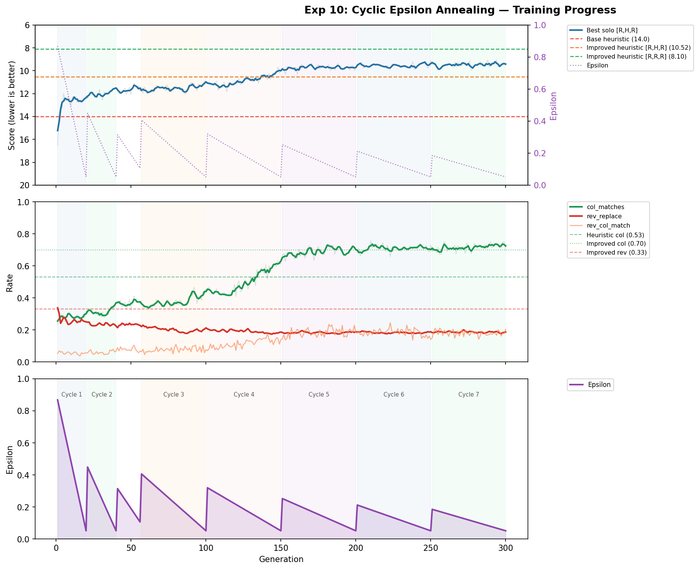

# Golf

What is the optimal strategy for the card game [Golf](https://en.wikipedia.org/wiki/Golf_(card_game))? Does counting cards matter, or do simple heuristics get you most of the way there?

This repo started as personal curiosity after a few rounds with friends. It turned into a fast vectorized simulator, a hand-coded heuristic baseline, and a deep RL setup that — eventually, after a lot of debugging — learned to beat the heuristic from scratch.

## Headline result

A vanilla DQN trained from scratch with no human knowledge of strategy plays Golf better than a strong hand-coded heuristic.

| Player | `[player, R, H, R]` | `[player, R, R, R]` |
|---|---:|---:|
| Random | 32.2 | 30.8 |
| Simple heuristic (greedy low cards) | — | 22.4 |
| Hand-coded heuristic (column-aware) | 14.0 | 14.0 |
| Improved heuristic (also replaces revealed cards) | 10.52 | 8.10 |
| **DQN champion (Exp 11, gen 343)** | **9.61** | **8.02** |

Lower is better. Eval config in column headers — `H` = hand-coded heuristic seat, `R` = random seat. 5000 games × 9 holes.



The figure shows Experiment 10 — the run where *cyclic epsilon annealing* (warm restarts on the exploration rate, discovered by accident) broke through what looked like a hard plateau and the agent crossed the improved-heuristic baseline around cycle 5. The follow-up Exp 11 (programmatic 7-cycle run, 343 generations) is the source of the table above.

The full lab notebook of how we got here — including two MDP bugs whose fixes were the real unlock, a representation-monopolization analysis, and the cyclic-epsilon discovery — is in [`docs/experiments.md`](docs/experiments.md). The TL;DR is in [`FINDINGS.md`](FINDINGS.md).

## LLM benchmark

Can frontier LLMs play Golf cold? Early results from the harness in `src/llm_player.py`:

| Model | Score (avg/hole) | vs hand-coded heuristic (~14) |
|---|---:|---:|
| Random baseline | 30.8 | -16.8 (worse) |
| **Claude Haiku 4.5** (5 runs × 9 holes) | **15.97** | **-2.0** (slightly worse) |
| DeepSeek-R1 7B (local) | 28.89 | -14.9 (random-tier) |
| Gemma 2 9B (local) | 31.11 | -17.1 (random-tier) |
| Hand-coded heuristic | 14.0 | — |
| DQN champion | 9.61 (vs `[R,H,R]`) | -4.4 (better) |

Haiku 4.5 plays decisively better than random but loses to the hand-coded heuristic in 4 of 5 runs. The smaller open models play at random level despite verbose `<think>` chains — reasoning didn't help. The harness is OpenAI-compatible and supports OpenRouter, Ollama, and LM Studio. Per-game results in [`data/llm_benchmarks.md`](data/llm_benchmarks.md).

## Game rules

Four players. Each player has 6 cards in a 2×3 grid, all face-down except two flipped at deal. On your turn:

1. **Draw:** take the top card from the discard pile, *or* draw blind from the deck.
2. **Place or flip:** put the held card at any grid position (the replaced card goes to discard, face-up), *or* discard the held card and flip one of your face-down cards.

The hole ends when any player has all 6 cards revealed; everyone else gets one final turn. After 9 holes, lowest cumulative score wins.

**Scoring:** 2 = -2, 3-9 = face value, 10/J/Q = 10, K = 0, A = 1. Matching ranks in the same column zero each other out.

## What's in the repo

```
src/
  vectorized_golf.py   # Fast batched game engine (numpy)
  tournament.py        # Population-based DQN training (the live pipeline)
  reward_shaping.py    # Hindsight reward shaping (fixes the observability bias)
  diagnostics.py       # MDP sanity checks for transitions, rewards, determinism
  optuna_search.py     # Hyperparameter search over tournament configs
  llm_player.py        # LLM player harness (OpenRouter / Ollama / LM Studio)
  analyze_embeddings.py / analyze_experiments.py  # Post-hoc analysis tools

scripts/
  eval_hof.py             # Eval a HuggingFace-hosted checkpoint
  eval_vs_random.py       # Eval tournament agents vs random opponents (GPU-batched)
  eval_compare.py         # Head-to-head DQN checkpoint comparison
  eval_heuristics.py      # Benchmark the hand-coded baselines
  plot_training_progress.py  # Plot per-gen metrics from a tournament run

docs/
  experiments.md           # The lab notebook (Experiments 1-11)
  beyond-heuristic-rl.md   # Pre-RL design notes on approaches considered
  figures/                 # Training-progress plots

data/
  llm_benchmarks.md        # LLM benchmark writeup and per-game results

deprecated/   # Superseded approaches kept for historical reference (don't expect to run)
```

## Quickstart

```bash
git clone https://github.com/vgainullin/golf.git
cd golf
uv sync
```

**Benchmark the heuristic baselines:**

```bash
uv run python -m scripts.eval_heuristics --games 5000 --holes 9
```

**Evaluate the published champion checkpoint** (downloads from HuggingFace):

```bash
uv run python -m scripts.eval_hof --repo-id vgainullin/golf --games 1000 --holes 9
```

**Run an LLM as a player** (requires `OPENROUTER_API_KEY` for hosted models):

```bash
uv run python -m src.llm_player --model anthropic/claude-haiku-4.5 --games 5 --holes 9
```

**Train your own DQN** (long, GPU recommended):

```bash
uv run python -m src.tournament \
  --model-variant v3 --hidden-dim-choices 256 --embedding-dim 64 \
  --population-size 8 --generations 350 --cycle-length 50 \
  --episodes-per-gen 1500 --buffer-capacity 100000 --batch-size 512 \
  --epsilon-start 0.868 --epsilon-end 0.051 \
  --lr-range 8.3e-5 0.0024 --updates-per-episode 8 \
  --target-update-interval 843 --gamma 0.99 --reward-shaping hindsight \
  --output-dir data/my_run
```

This is the Experiment 11 config. With cyclic epsilon (`--cycle-length`), it reaches solo ~9.6 by generation 343.

**Run the MDP diagnostics on your environment:**

```bash
uv run python -m src.diagnostics
```

The diagnostics catch the same class of bug that took us five failed experiments to find by hand. See [`docs/experiments.md`](docs/experiments.md) (search for "MDP Diagnostics Toolkit").

## What's still open

The DQN can play Golf well but it can't *explain* what it's doing. Three threads are open and welcome contributions:

1. **Strategy extraction.** Distill the champion's policy into human-readable rules — does it actually count cards? Does it have a different opening from the endgame? The behavioral metrics in the lab notebook hint at answers, but no one has read out the actual decision rules.
2. **LLM benchmark expansion.** The current results cover Haiku, DeepSeek-R1 7B, and Gemma 2 9B. A broader leaderboard — Sonnet, Opus, GPT-5, Gemini, larger open models — would make this a much sharper artifact.
3. **Playable web/mobile game.** The simulator is fast and self-contained. Wrapping it in a UI to play against the heuristic, the DQN, or an LLM would make this a useful airplane-mode time-killer.

## License

[MIT](LICENSE).
